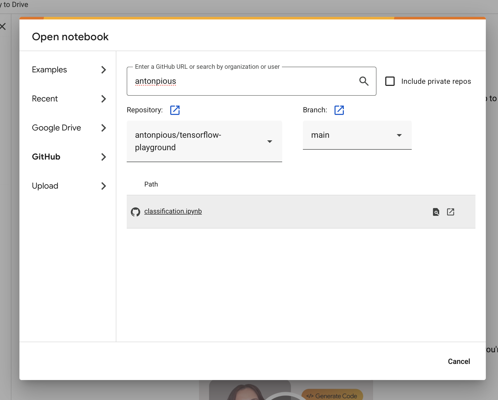
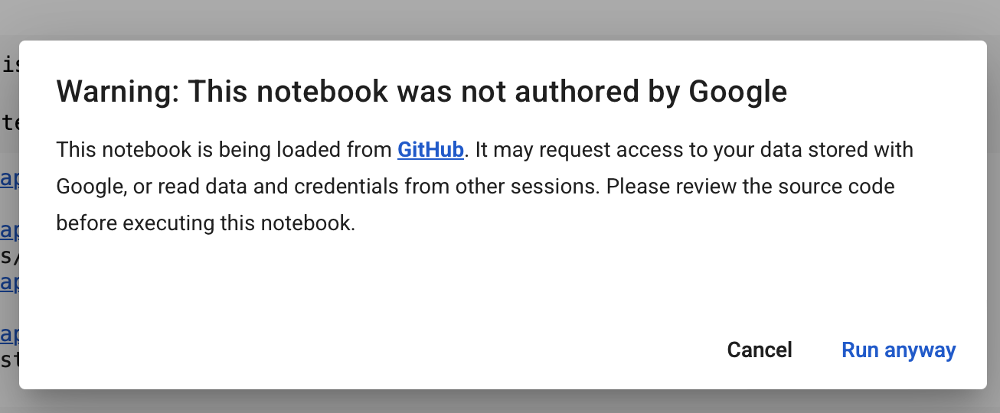
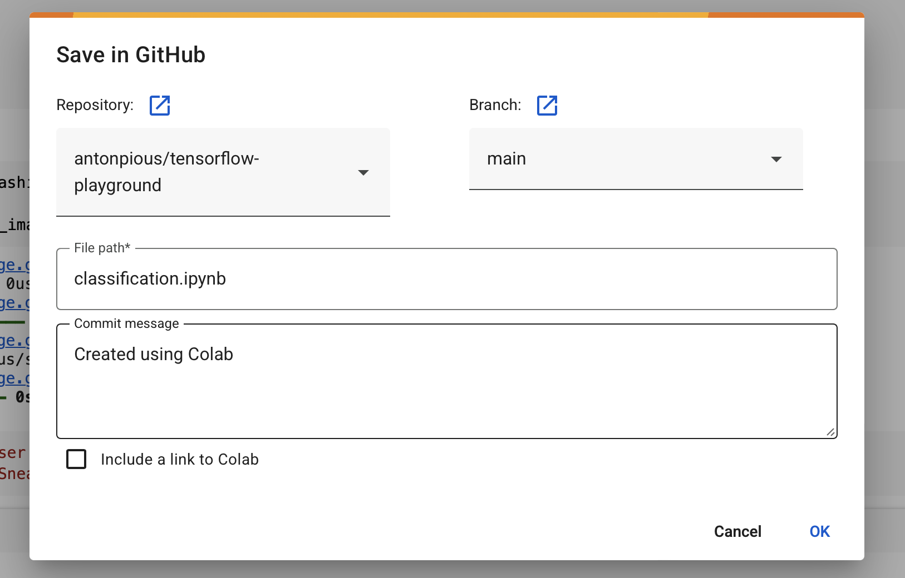

# tensorflow-playground
Tensor Flow python coding examples

## Opening a Jupyter notebook in Google CoLab

 

1. Login to Google CoLab  
2. Click on File->Open Notebook  
3. On the left go to the Github tab  
4. On the right search by the GitHub URL, username or Organization Name  

If its found it would display a list of notebook that are present  
5. Click on the notebook to open in new window
6. This would provide a warning if you want to continue running this code as its from Github external source

7. Click on "Run Anyway"

Notes:
Shortcut to open Markdown Preview in VSCode (in Mac)   
Command k + v 

## Saving Changes to GitHub
1. Start making changes to the notebook
2. You would see a link text on the top of the notebook saying "Save in GitHub to keep Changes"

3. If you have not connected to GitHub and this is the first time, it would open a popup to login to GitHub and to give authorize permission to repositories from your account or if you belong to other Organization provide permissions to those organization as well.
4. Select the required permission and then save.

5. Once done when you save it would now open a popup with the commit comments dialog to check-in this notebook to GitHub
 
6. Once the commit message is entered click "Ok"
7. The notebook would now be checked-in
8. You can continue to edit and repeat the process to make more changes.

